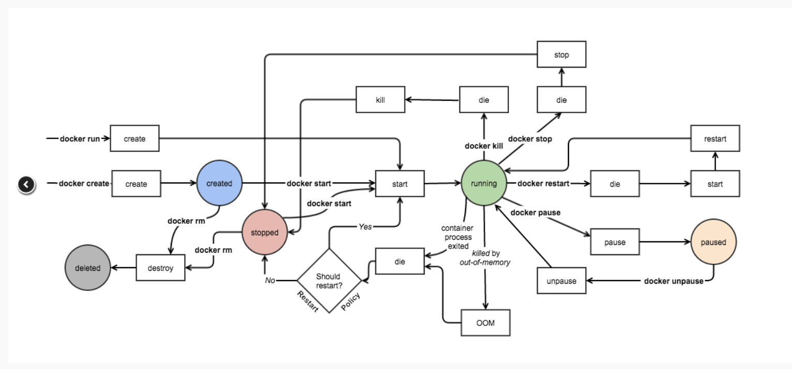
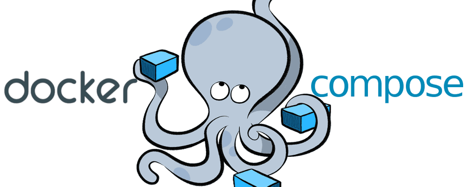
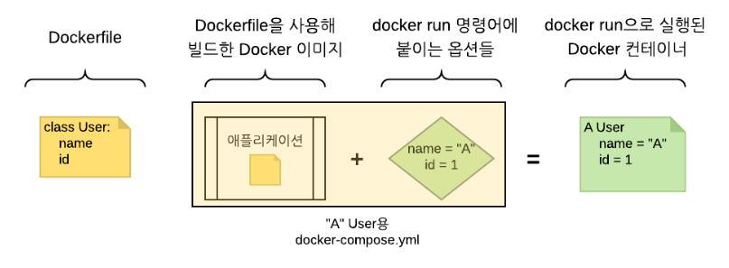

# Docker


## 목차

- Docker의 설치
- Docker의 실행
- 명령어(이미지, 컨테이너)
- 컨테이너의 이미지화
- 컨테이너 외부노출
- dockerfile 생성 및 실습
- 컨테이너에 데이터 저장(볼륨, 바인트 마운트)
- Docker compose


## Docker 의 설치

### docker의 환경 맞추기 (os : ubuntu)

> 각각 한줄씩 terminal에 입력을 해준다.

```bash
$ sudo apt update
$ sudo apt install apt-transport-https ca-certificates curl software-properties-common
$ curl -fsSL https://download.docker.com/linux/ubuntu/gpg | sudo apt-key add -
$ sudo add-apt-repository "deb [arch=amd64] https://download.docker.com/linux/ubuntu bionic stable"
$ sudo apt update
```

### 환경 확인하기


```bash
$ apt-cache policy docker-ce
docker-ce: 
	Installed: (none) 
	Candidate: 19.03.12~3-0~ubuntu-focal
```

> install 부분이 아직 none이므로 도커는 설치 되지않은것을 알 수 있다.

### 설치하고 확인

```bash
$sudo apt install docker-ce

$ sudo systemctl status docker
● docker.service - Docker Application Container Engine
     Loaded: loaded (/lib/systemd/system/docker.service; enabled; vendor preset: enabled)
     Active: active (running) since Tue 2020-06-30 09:20:42 KST; 2h 38min ago
TriggeredBy: ● docker.socket
       Docs: https://docs.docker.com
   Main PID: 788 (dockerd)
      Tasks: 10
     Memory: 137.5M
     CGroup: /system.slice/docker.service
             └─788 /usr/bin/dockerd -H fd:// --
...(생략)

$ sudo apt-cache policy docker-ce
docker-ce:
  Installed: 5:19.03.12~3-0~ubuntu-focal
  Candidate: 5:19.03.12~3-0~ubuntu-focal
  Version table:
 *** 5:19.03.12~3-0~ubuntu-focal 500
        500 https://download.docker.com/linux/ubuntu focal/stable amd64 Packages
        100 /var/lib/dpkg/status
...(생략)
```

> systemctl에서 docker의 status를 확인해보면 active(running)를 확인할 수 있다.
>
> 또한 위에서 환경을 확인해 보았을때는 Installed: (none) 이 Installed: 5:19.03.12~3-0~ubuntu-focal로 변경 되었음을 확인할 수 있다.

<hr/>

## Docker를 sudo 없이 실행

> docker를 사용하다보면 docker 데몬이 root권한으로 실행되기 때문에 sudo를 붙여줘야하는 불편함이 있다. 이를 해결 하기 위해 로그인 계정을 docker 그룹에 추가해준다.

```bash
$ sudo usermod -aG docker $USER
$ sudo service docker restart
```

> 위 명령어를 실행시 프로그램을 종료후 다시 로그인 해도 sudo 없이 docker 명령어의 실행이 가능하다.

<hr/>

## 명령어(이미지, 컨테이너)

도커에는 크게 이미지와 컨테이너가 존재 한다. 

### 이미지

>image란 필요한 프로그램, 라이브러리, 소스 등을 설치한 뒤에 이를 파일로 만든 것이다.
>
>docker는 docker 이미지를 이용하여 컨테이너를 생성할 수 있다. 
>
>도커 이미지를 이용하면 이미지에 설정해둔 대로 컨테이너의 구성환경을 적용할 수 있다.

- 버전 간단 확인(-v)

```bash
$ docker -v
Docker version 19.03.12, build 48a66213fe
```

- 버전(version)

```bash
$ docker version
Client: Docker Engine - Community
 Version:           19.03.12
 API version:       1.40
...
Server: Docker Engine - Community
 Engine:
  Version:          19.03.12
  API version:      1.40 (minimum version 1.12)
...
```

Server가 안나올때 : docker 가 root계정으로 설치 되었을때 root계정이 아닌 계정으로 docker를 실해하고자 할때 server가 안나옴 (위에서 Docker를 sudo 없이 실행 부분을 시연 했다면 뜨지않음)

```bash
$ sudo usermod -aG docker $USER
$ sudo service docker restart
```

- 이미지 목록 보기(images)

```bash
$ docker images | $ docker image ls
REPOSITORY          TAG                 IMAGE ID            CREATED             SIZE
ubuntu              latest              74435f89ab78        11 days ago         73.9MB
ubuntu              18.04               8e4ce0a6ce69        11 days ago         64.2MB
```

- 이미지 검색(search)

```bash
$ docker search [이미지 이름]
ex) $ docker search ubuntu
```

- 이미지 받기(pull)

```bash
$ docker pull [이미지 이름]:[버전]
ex) $ docker pull ubuntu:16.04
```

> 버전에 latest를 쓰면 최신 버전으로 받을수 있다.
>
> 혹은 그냥 이미지 이름을 써도 : latest가 붙어서 최신 버전을 받는다.

- 이미지 삭제(rmi)

```bash
$ docker rmi [이미지 id]
$ docker rmi -f [이미지 id]
```

> 컨테이너를 삭제하지 않고 이미지를 삭제할때 **-f** 옵션을 붙이면 컨테이너도 같이 삭제가 된다.

### 컨테이너

> Container란 생성된 이미지가 실행된 상태이다. 
>
> 이미지를 여러 번 실행시키면 여러 개의 컨테이너가 만들어진다. 
>
> 컨테이너는 이미지를 읽기전용으로 실행 한다.

- 컨테이너 목록 보기(ps)

```bash
$ docker ps [옵션]
```

> -a : 모든 컨테이너 목록 출력

- 컨테이너 만들고 실행(run)

```bash
$ docker run [옵션] [이미지 이름] : [태그]
ex) $ docker run --rm -it --name server ubutu:latest /bin/sh
=> ubuntu 최신버전, server name을 가진 컨테이너의 /bin/sh를 -it 옵션을 준 후에 실행 시킨후 프로세스 종료시 컨테이너를 제거한다.
```

> -d : 백그라운드 모드 
>
> -p : 호스트와 컨테이너의 포트를 연결(포워딩)
>
> -v : 호스트와 컨테이너의 디렉토리를 연결(마운트)
>
> -e : 컨테이너 내에서 사용할 환경변수 설정
>
> --name : 컨테이너 이름 설정, 이름을 설정하지 않을시 랜덤으로 생성된다.
>
> -i : 상호입출력
>
> -t : tty를 활성화하여 bash 쉘을 사용
>
> -it : -i 와 -t를 동시에 사용한 것으로 터미널 입력을 위한 옵션(컨테이너의 표준 입력과 로컬 컴퓨터의 키보드 입력을 연결)
>
> --rm : 프로세스 종료시 컨테이너 자동 제거
>
> --link : 컨테이너 연결 [컨테이너명 : tag]
- 컨테이너 나가기

> ctrl + p,q를 누르면 현재 실행중인 docker의 shell을 나간다, 실행중인 container는 백그라운드 모드로 변경된다.
>
> exit를 입력하면 실행중이 docker를 종료 시키고 나간다.

- 컨테이너 시작(start)

> stop으로 중지된 container를 실행시킨다.

```bash
$ docker start [컨테이너 id 또는 name]
ex) $ docker start 74435f89ab78 or docker start ubuntu:18.04
```

- run과 start, stop의 차이

> run : 새로운 컨테이너를 이미지로부터 만든다.
>
> start, stop : 기존에 실행 되었던 컨테이너를 실행시키거나 중지시킨다.

- 만들어진 컨테이너 들어가기(attach)

> 백그라운드로 실행중인 container에 들어 갈때 사용된다.

```bash
$ docker attach ubuntu:latest
```

- 컨테이너 재시작(restart)

```bash
$ docker retart [컨테이너 id 또는 name]
ex) $ docker restart 74435f89ab78 or docker restart ubuntu:18.04
```

- 컨테이너 정지(stop)

```bash
$ docker stop [컨테이너 id 또는 name]
ex) $ docker restart 74435f89ab78 or docker restart ubuntu:18.04
```

- 컨테이너 이름 변경(raname)

```bash
$ docker rename [기존 이름] [새로운 이름]
```

- 외부에서 컨테이너 안의 명령을 실행(exec)

```bash
$ docker exec [옵션] [컨테이너 이름, ID] [명령] [매개변수]
ex) $ docker exec -it etest /bin/bash
```

> <u>옵션</u>
>
> -d : 명령을 백그라운드로 실행한다.
>
> -i : 표준입력모드 활성화
>
> -t : tty모드, bash 사용시 필요함, 없어도 명령 실행 가능하나 쉘표시 X

- exec의 예제

```bash
$sudo docker run -d --name etest ubuntu:16.04 /bin/bash -c "while true; do echo Hello World; sleep 1; done"
$docker ps 
CONTAINER ID        IMAGE               COMMAND                  CREATED             STATUS              PORTS               NAMES
8baf9b0b0b98        ubuntu:16.04        "/bin/bash -c 'while…"   2 minutes ago       Up 2 minutes                            etest
```

> name이 etest인 컨테이너를 하나 생성한다.
>
> -d 옵션을 통해 백그라운드에서 while문을 계속 해서 실행한다.

```bash
ubuntu11@ubuntu11:~$ docker exec -it etest /bin/bash
root@8baf9b0b0b98:/# ps ax
    PID TTY      STAT   TIME COMMAND
      1 ?        Ss     0:00 /bin/bash -c while true; do echo Hello World; sleep 1; done
    259 pts/0    Ss     0:00 /bin/bash
    270 ?        S      0:00 sleep 1
    271 pts/0    R+     0:00 ps ax
root@8baf9b0b0b98:/# exit
```

> exec를 통해 etest컨테이너로 들어가서 쉘을 실행시킨다.
>
> ps ax를 실행시켜보면 hello world를 출력하는 /bin/bash와는 별개로 docker exec 명령으로 실행한 /bin/bash를 확인 할수 있다.
>
> 이때 exit를 입력하여 쉘을 빠져나가도 컨테이너는 정지되지 않고 <u>계속 실행된다</u>.

```bash
$ docker exec hello apt-get update
```

> 이 처럼 bash쉘을 연결하지 않고 apt-get update과 같은 명령어를 실행시킬수 있다.

- 컨테이너 이미지화 (commit)

> 컨테이너를 이미지화 하기 전에 컨테이너를 멈춰준다

```bash
$ docker ps -a
CONTAINER ID        IMAGE               COMMAND             CREATED             STATUS                        PORTS               NAMES
2167b8a5218f        ubuntu:16.04        "/bin/bash"         8 minutes ago       Exited (0) 11 seconds ago           
```
> 2167b8a5218f이 방금 종료 된 컨테이너이다

```bash
$ docker commit <옵션> <컨테이너 이름, ID> <저장소 이름>/<이미지 이름>:<태그>

$ docker commit -a "jheok" 2167b8a5218f test_con/[주석 넣기가능]
sha256:762362327c7508180ede8aa666e5606bb4db0b5d60d8d10f5ea2b5754d68f9ab

$docker images
REPOSITORY          TAG                 IMAGE ID            CREATED             SIZE
test_con            latest              762362327c75        29 seconds ago      250MB
ubuntu              16.04               330ae480cb85        12 days ago         125MB
ubuntu              latest              74435f89ab78        12 days ago         73.9MB
```

> 옵션
>
> -a : 생성한 사람의 정보를 설정할수 있다.
>
> -m : 변경 사항에 대한 로그 메시지를 설정한다.
>
> -p : 이미지를 생성하는 동안 컨테이너를 일시 정지 한다.
>
> test_con이미지가 생성 됨을 확인할 수 있다.

<hr/>

## 도커 컨테이너 라이프 사이클




<hr/> 

## 컨테이너 외부 노출(nginx이용하여 웹서버 실행)

```bash
$ docker run -d -p 8000:80 nginx:latest
$  curl localhost:8000
<!DOCTYPE html>
<html>
<head>
...
</body>
</html>
```

> 실행이 됨을 확인 할수 있다.

<hr/> 

## Dokcerfile로 이미지 생성하기(예시)

```dockerfile
#vi dockerfiles
FROM ubuntu:16.04
MAINTAINER thismain<thismain@test.com>

RUN apt-get update
RUN apt-get install -y nginx
RUN echo "\dameon off;" >> /etc/nginx/nginx.conf
RUN chown -R www-data:www-data /var/lib/nginx

VOLUME ["/data","/etc/nginx/site-enabled", "/var/log/nginx"]

WORKDIR /etc/nginx

CMD ["nginx"]

EXPOSE 80
EXPOSE 443
```

> FROM : base image를 지정할때 사용한다. ubuntu:16.04 처럼 os와 버전까지 정확히 지정해주는것이 좋다.
>
> ```dockerfile
> FROM <이미지>
> FROM <이미지>:<태그>
> ex) FROM ubuntu:16.04
> ```
>
> 
>
> MAINTAINER : 이미지를 생성한 사람의 정보를 설정한다. 형식은 자유이나 위와같은 형식으로 작성해준다. 생략이 가능하다.
>
> ```dockerfile
> MAINTAINER 사용자ID<사용자 e-mail>
> ex) MAINTAINER thismain<thismain@test.com>
> ```
>
> 
>
> RUN : package를 설치하는 것 등등의 shell commnad를 해당 docker image에 실행 시킬때 사용한다.
>
> ```dockerfile
> RUN ["<커맨드>","<파라미터1>","<파라미터2>"]
> RUN <전체 커맨드>
> ex) RUN pip install -r requirements.txt
> ```
>
> 
>
> VOLUME : instruction을 사용하여 호스트의 dir를 docker컨테이너에 연결 시킬수 있다. 그래서 데이터, 소스코드, 외부설정파일 등등을 docker image에 commit하지 않고 docker containr에서 사용 가능 하도록 한다. 
>
> ```dockerfile
> VOLUME ["경로1", "경로2"]
> ex) VOLUME ["/data","/etc/nginx/site-enabled", "/var/log/nginx"]
> ```
>
> 
>
> WORKDIR : working dir를 지정해준다. ubuntu의 cd와 같은 개념으로 생각한다.
>
> ```dockerfile
> WORKDIR <이동할 경로>
> ex) WORKDIR /usr/app
> ```
>
> 
>
> ENTRYPOINT : 이미지를 컨테이너로 띄울 때 항상 실행되야 하는 커맨드를 지정할때 사용한다.
>
> - Django 서버 실행
>
> ```dockerfile
> ENTRYPOINT ["<커맨드>","<파라미터1>","<파라미터2>"]
> ENTRYPOINT <전체 커맨드>
> 
> ex) ENTRYPOINT ["python3","manage.py","runserver"]
> ```
>
> 
>
> CMD : 이 커맨드를 사용하여 docker container가 시작할때 실행할 커맨드를 지정할수 있다. RUN과 기능은 비슷하다 하지만 CMD는 docker image를 빌드할때 실행되는 것이 아닌 docker conatiner가 시작될때 실행 된다.
>
> ```dockerfile
> CMD ["<커맨드>","<파라미터1>","<파라미터2>"]
> CMD ["<파라미터1>","<파라미터2>"]
> CMD <전체 커맨드>
> 
> ex) CMD ["echo", "Hi"]
> $ docker run test
> Hi
> $ docker run test echo Bye
> Bye
> 파라미터 없이 이미지를 실행하면 hi가 출력 되지만 파라미터를 넘겨주면 해당 파라미터가 출력된다.
> ```
>
> 
>
> EXPOSE : docker container 외부에 노출할 포트를 지정할때 사용한다. 80 port, 443port를 노출하고 싶다면 위와 같이 명시한다. EXPOSE instruction을 지정 해주었다고 해서 곧바로 그 포트를 외부에서 접속 할수 는 없다 . docker는 포트를 자동으로 open하지 않는다. Docker container를 실행할때 EXPOSE를 통해 지정된 포트를 열어 주어야 한다. expose에는 주석을 넣으면 안된다.
>
> ```dockerfile
> EXPOSE <포트>
> EXPOSE <포트>/<프로토콜>
> 
> ex) EXPOSE 80
> 	EXPOSE 443/UDP
> ```
>
> 
>
> COPY : COPY명령문은 호스트의 dir나 file을 docker 이미지의 파일 시스템으로 복사하기 위해 사용한다. 절대, 상대 경로 모두 지원한다.
>
> ```dockerfile
> COPY <시작>... <목적>
> COPY ["<시작>",... "<목적>"]
> 
> ex) COPY package.json package.json
> ```
>
> 
>
> ADD : COPY명령문과 비슷하나 일반 파일 뿐만 아니라 압축 파일이나 네트워크 상의 파일도 사용할 수 있다. 
>
> ```dockerfile
> ADD <시작>... <목적>
> ADD ["<시작>",... "<목적>"]
> 
> ex) ADD package.json package.json
> ```
>
> 
>
> ENV : 환경변수를 지정할때 사용한다. ENV로 지정한 환경변수는 $변수명, ${변수명}으로 작성한다.
>
> ```dockerfile
> ENV <키> <값>
> ENV <키>=<값>
> 
> ex) ENV GOPATH /go
> 	ENV PATH /go/bin:$PATH
> ```
>
> 
>
> USER : 해당 docker image를 실행할 user를 지정해준다.
>
> ```dockerfile
> USER test1
> USER root
> ```

<hr/>

## dockerfile 생성후 image파일 생성 

- **docker file 작성**

```dockerfile
#vim
FROM centos:7
MAINTAINER thisisme

RUN mkdir /helloworld
WORKDIR /helloworld 
COPY go.log go1.log
ADD out.sh out2.sh 
RUN chmod 755 go1.log 
RUN chmod 755 out2.sh
```

> centos 7을 다운받은후 helloworld 폴더를 생성한다 이후 work space를 helloworld에서 작업을 하고 go.log와 out.sh를 host에서 image파일로 복사를 해준다 이후 go1.log와 out2.sh의 권한을 변경 해준다.

- **image 생성 (build)**

```bash
ubuntu11@ubuntu11:~/docker11$ docker build -t ttest /home/ubuntu11/docker11/
Sending build context to Docker daemon  3.584kB
Step 1/8 : FROM centos:7
7: Pulling from library/centos
524b0c1e57f8: Pull complete
Digest: sha256:e9ce0b76f29f942502facd849f3e468232492b259b9d9f076f71b392293f1582
Status: Downloaded newer image for centos:7
 ---> b5b4d78bc90c
Step 2/8 : MAINTAINER thisisme
 ---> Running in 74d3d1e82384
Removing intermediate container 74d3d1e82384
 ---> 95d17f420d4a
Step 3/8 : RUN mkdir /helloworld
 ---> Running in fbc13727a0b9
Removing intermediate container fbc13727a0b9
 ---> 920fb667fb1e
Step 4/8 : WORKDIR /helloworld
 ---> Running in 26f0ad6daac0
Removing intermediate container 26f0ad6daac0
 ---> d4a8d6177336
Step 5/8 : ADD go.log go.log
 ---> 8506e1299b5b
Step 6/8 : ADD out.sh out.sh
 ---> 6268f568e663
Step 7/8 : RUN chmod 755 go.log
 ---> Running in 98b34e1f8d36
Removing intermediate container 98b34e1f8d36
 ---> 7812a2282dbd
Step 8/8 : RUN chmod 755 out.sh
 ---> Running in 0ee9fa3c94ae
Removing intermediate container 0ee9fa3c94ae
 ---> 442463113987
Successfully built 442463113987
Successfully tagged ttest:latest
ubuntu11@ubuntu11:~/docker11$ docker images
REPOSITORY          TAG                 IMAGE ID            CREATED             SIZE
ttest               latest              442463113987        8 seconds ago       203MB
centos              7                   b5b4d78bc90c        7 weeks ago         203MB

```

> docker build -t ttest /home/ubuntu11/docker11/
>
> dockerfile이 있는 docker11에 경로를 지정해주고 ttest 라는 image를 만들었다.
>
> 옵션
>
> -t : -t <저장소 이름>/<이미지 이름>:<태그> 형식으로 저장소, 이미지이름, 태그를 설정해줄수 있다.
>
> -q : docker file이 실행될때 출력결과를 표시하지 않는다.
>
> --rm : docker file 실행 후 이미지생성이 성공하면 임시 container를 삭제한다.

- 실행

```bash
$ docker run -it ttest /bin/cat go1.log
this is log file!!
```

- 생성된 image에 접속해서 확인하기

```bash
$ docker run -it ttest /bin/bash
[root@9c1d783e41d4 helloworld]# pwd
/helloworld
[root@9c1d783e41d4 helloworld]# cat go1.log
this is log file!!
```

<hr/>

## Docker 컨테이너에 데이터 저장

>  Docker 컨테이너에서 쓰여진 데이터는 기본적으로 컨테이너가 삭제될 때 함께 사라지게 된다.
>
> 하지만 Docker에서 돌아가는 많은 어플리케이션이 컨테이너의 생명 주기에 관계없이 영속적으로 저장을 해야 한다
>
> 이를 2가지 방식으로 Docker는 옵션을 제공한다.
>
> 1. 볼륨(Volume)
> 2. 바인트 마운트(bind mount)

>  

### 볼륨(Volume)

- 생성(create) 및 조회(ls), 상세 조회(inspect)

```bash
$ docker volume create our-vol
our-vol
$ docker volume ls
DRIVER              VOLUME NAME
local               our-vol
$ docker volume inspect our-vol
[
    {
        "CreatedAt": "2020-06-29T16:18:26+09:00",
        "Driver": "local",
        "Labels": {},
        "Mountpoint": "/var/lib/docker/volumes/our-vol/_data",
        "Name": "our-vol",
        "Options": {},
        "Scope": "local"
    }
]
```

- 볼륨을 컨테이너에 마운트하기

> 컨테이너가 볼륨을 사용하기 위해서는 봉륨을 컨테이너에 마운트 해줘야 한다.
>
> docker run 커맨드로 **-v** 옵션을 사용하면 된다.
>
> 콜론(:)을 구분자로 해서 앞(마운트할 볼륨), 뒤(컨테이너 내의 경로)를 명시해주면 된다.
>
> 예를 들어 our-vol을 one컨테이너의 /app경로에 마운트를한다
>
> one : 컨테이너의 이름
>
> busybox : 이미지의 이름

```bash
$ docker run -v our-vol:/app --name one busybox touch /app/test.txt
```

> touch /app/test.txt 커맨드를 실행하였기 때문에, test.txt 파일이 our-vol 볼륨의 경로에서 남아있다.

```bash
# ls /var/lib/docker/volumes/our-vol/_data/
test.txt
```

> docker inspect로 컨테이너의 상세 정보를 확인해 보면 our-vol 볼륨이 volume타입으로 마운트 되어 있다.

```bash
$ docker inspect one
...
"Mounts": [
            {
                "Type": "volume",
                "Name": "our-vol",
                "Source": "/var/lib/docker/volumes/our-vol/_data",
                "Destination": "/app",
                "Driver": "local",
                "Mode": "z",
                "RW": true,
                "Propagation": ""
            }
        ],
...
```

- 볼륨 삭제

```bash
$ docker volume rm our-vol
Error response from daemon: remove our-vol: volume is in use - [5f05b72f81fc20be5a68a7a39...
```

> 제거하려는 볼륨이 마운트되어 있는 컨테이너가 있을 때는 볼륨이 제거 되지 않는다.
>
> 이럴때는 볼륨이 마운트 되어 있는 컨테이너를 삭제하고 볼륨을 삭제해야 한다.

```bash
$ docker rm -f one two
one
two
$ docker volume rm our-vol
our-vol
```

- 볼륨 청소

> 마운트되어 있지 않은 모든 볼륨을 한번에 제거할 수 있습니다.

```bash
$ docker volume prune
```

### 바인트 마운트

> 호스트 파일 시스템의 특정 경로를 컨테이너로 바로 마운트할 수 있다.
>
> docker run 커맨드를 실행할때 **-v** 옵션의 콜론(:) 앞 부분에 마운트명 대신 호스트의 경로를 지정해주는 것이다.
>
> 예를 들어 현재 경로에 test.txt를 생성하고, 해당 호스트 경로를 컨테이너의 /app 경로에 마운트 하는방법을 예시로 들어보자.

```bash
$ touch test.txt
$ docker run -v `pwd`:/app -it --name one busybox /bin/sh
/ # ls /app
test.txt
```

### 볼륨 VS 바인드 마운트

> 볼륨과 바인드 마운트의 가장 큰 차이점은 Docker가 해당 마운트 포인트를 관리 해주냐 안해주냐 이다.
>
> 볼륨을 사용할 때는 스스로 볼륨을 생성하거나 삭제하거나 하는 불편함이 있다.
>
> 하지만 Docker 상에서 image나 container, network와 비슷한 방식으로 관리가 되는 이점이 있다.
>
> 그래서 대부분의 상황에서는 볼륨이 권장된다.
>
> 하지만 컨테이너화된 로컬 개발 환경을 구성할 때는 바인트 마운트가 이점이 있다.

<hr/>

## Docker Compose



### Docker Compose란?

> 여러개의 컨테이너를 일괄적으로 관리하는 도구
>
> Docker-Compose는 docker와는 별개의 도구이지만 Docker ce for windows에서 기본적으로 제공한다.

### Docker-compose.yml

> Docker-Compose.yml은 Docker-Compose의 구성 파일이다.
>
> 한 파일 안에 여러 컨테이너 설정 내용을 저장한다.
>
> 도커 어플리케이션을 위한 서비스, 네트워크, 볼륨 등을 정의 할수 있다. 
>
> Docker-Compose의 구성 파일은 텍스트 파일인 YAML 형식을 사용한다.
>
> 사용 시 주의사항은 탭 대신 공백을 사용해야 하고, 배열 데이터의 경우 '-' 기호를 붙여야 한다는 것은 꼭 기억해야 한다.

- docker build => docker-compose build : 도커 이미지 만들기
- docker run [옵션] => docker-compose.yml : 이미지에 넣는 파라미터
- docker run => docker-compose up : 파라미터가 들어간 이미지를 실제로 실행



- 설치하기

```bash
$ sudo curl -L "https://github.com/docker/compose/releases/download/1.9.0/docker-compose-$(uname -s)-$(uname -m)" -o /usr/local/bin/docker-compose

  % Total    % Received % Xferd  Average Speed   Time    Time     Time  Current
                                 Dload  Upload   Total   Spent    Left  Speed
100   638  100   638    0     0  14177      0 --:--:-- --:--:-- --:--:-- 14177
100 7857k  100 7857k    0     0   866k      0  0:00:09  0:00:09 --:--:-- 1080k
```

- docker-compose 사용하기

```bash
$ sudo chmod +x /usr/local/bin/docker-compose

#버전을 확인해보자
$ docker-compose version
docker-compose version 1.9.0, build 2585387
docker-py version: 1.10.6
CPython version: 2.7.9
OpenSSL version: OpenSSL 1.0.1t  3 May 2016

$ docker-compose -v
docker-compose version 1.9.0, build 2585387
```

- docker-compose.yml 사용해보기

> 아래의 예제를 설치해보자

```bash
$ docker pull alicek106/composetest:web
$ docker pull alicek106/composetest:mysql
```

> 하나는 web, 하나는 mysql이다.
>
> web서비스는 mysql 서비스에 접속해 DB를 사용(--link)한다.
>
> web서비스를 외부에서 접속 할수 있게 80번 port를 열어 80번 호스트 port와 연결(-p)하며 mysql 서비스에 링크 시킨다.
>
> 웹서버가 작동하도록 command를 준다.
>
> mysql 서비스 또한 command를 주어 컨테이너 시작시 mtsql이 작동하도록 한다.

```yaml
#vim docker-compose.yml

#docker run -d -p 80:80 --link mysql:db --name web alicek106/composetest:web apachectl -DFOREGROUND
web:
  image: alicek106/composetest:web
  ports:
   - "80:80"
  links:
   - mysql:db
  command: apachectl -DFOREGROUND
  
#docker run -d --name mysql alicek106/composetest:mysql mysqld
mysql:
  image: alicek106/composetest:mysql
  command: mysqld
```

> 결론 => .yml을 이용하여 두 컨테이너를 돌린다.

- docker-compose.yml 실행 (docker-compose up)

> -d 옵션을 주어 백그라운드로 실행시킨다.
>
> -d 옵션을 주지 않을시 터미널을 하나 차지한다.

```bash
$ docker-compose up -d
Creating dockercom_mysql_1
Creating dockercom_web_1
```

- 만들어진 container 확인 (docker-compose ps)

> docker-compose ps 로 확인을 해보자.
>
> 만들어진 container를 확인 할수 있다.

```bash
$ docker-compose ps
      Name                 Command           State    Ports
-----------------------------------------------------------
dockercom_mysql_1   mysqld                   Up
dockercom_web_1     apachectl -DFOREGROUND   Exit 0
```

- 특정 container의 갯수 설정 (docker-compose scale)

> docker-compose scale을 이용해 보자.

```bash
# mysql container 3개로 늘리기
$ docker-compose scale mysql=3
$ docker-compose ps
      Name                 Command           State    Ports
-----------------------------------------------------------
dockercom_mysql_1   mysqld                   Up
dockercom_mysql_2   mysqld                   Up
dockercom_mysql_3   mysqld                   Up
dockercom_web_1     apachectl -DFOREGROUND   Exit 0
```

- 특정 서비스 container만 만들기

> yml파일에서 설정해준 이름을 따로 지정해준다.

```bash
# mysql만 만들기 
$ docker-compose up -d mysql
```

- Interactive shell 사용하기

> -it 옵션을 줄 필요가 없어진다.

```bash
$ docker-compose run web /bin/bash
root@0143fc8aad85:/#
```

- 만들어진 container 삭제하기 (down)

```bash
$ docker-compose down 
Stopping dockercom_mysql_3 ... done
Stopping dockercom_mysql_2 ... done
Stopping dockercom_mysql_1 ... done
Removing dockercom_web_run_1 ... done
Removing dockercom_mysql_3 ... done
Removing dockercom_mysql_2 ... done
Removing dockercom_web_1 ... done
Removing dockercom_mysql_1 ... done
```

- 프로젝트의 이름 설정후 관리 (-p)

> -p 옵션을 사용하여 프로젝트의 이름을 설정할 수 있다.
>
> docker-compose -p로 관리

```bash
# 프로젝트 이름 myproject로 설정하여 compose 생성
$ docker-compose -p myproject up -d

# 프로젝트 이름 myproject 확인하기
$ docker-compose -p myproject ps

# 프로젝트 이름 myproject 종료
$ docker-compose -p myproject down
```

