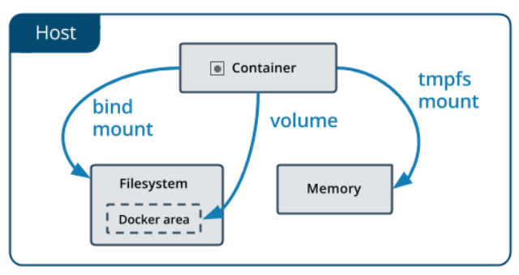

# Docker

#### docker의 설치

```
sudo apt update
sudo apt install apt-transport-https ca-certificates curl software-properties-common
curl -fsSL https://download.docker.com/linux/ubuntu/gpg | sudo apt-key add -
sudo add-apt-repository "deb [arch=amd64] https://download.docker.com/linux/ubuntu bionic stable"
sudo apt update
apt-cache policy docker-ce
```

> 각각 한줄씩 ubuntu terminal에 입력을 해준다.

<hr/>

## docker sudo 없이 실행

> docker를 사용하다보면 docker 데몬이 root권한으로 실행되기 때문에 sudo를 붙여줘야하는 불편함이 있다. 이를 해결 하기 위해 로그인 계정을 docker 그룹에 추가해준다.

```
sudo usermod -aG docker $USER
```

> 위 명령어를 실행시 프로그램을 종료후 다시 로그인 해도 sudo 없이 docker 명령어의 실행이 가능하다.

<hr/>

## Docker 명령어

###### **이미지 관련**

>image란 필요한 프로그램, 라이브러리, 소스 등을 설치한 뒤에 이를 파일로 만든 것이다.
>
>docker는 docker 이미지를 이용하여 컨테이너를 생성할 수 있다. 
>
>도커 이미지를 이용하면 이미지에 설정해둔 대로 컨테이너의 구성환경을 적용할 수 있다.

- 버전확인

```
docker -v
Docker version 19.03.12, build 48a66213fe
```

- 이미지 목록 보기

```
sudo docker images
REPOSITORY          TAG                 IMAGE ID            CREATED             SIZE
ubuntu              latest              74435f89ab78        11 days ago         73.9MB
ubuntu              18.04               8e4ce0a6ce69        11 days ago         64.2MB
```

- 이미지 검색

```
sudo docker search [이미지 이름]
ex) sudo docker search ubuntu
```

- 이미지 받기

```
sudo docker pull [이미지 이름]:[버전]
ex) sudo docker pull ubuntu:16.04
```

> 버전에 latest를 쓰면 최신 버전으로 받을수 있다.

- 이미지 삭제

```
sudo docker rmi [이미지 id]
sudo docker rmi -f [이미지 id]
```

> 컨테이너를 삭제하기 전에 이미지를 삭제할때 **-f** 옵션을 붙이면 컨테이너도 강제 삭제가 가능하다.

###### **컨테이너 관련**

> Container란 생성된 이미지가 실행된 상태이다. 
>
> 이미지를 여러 번 실행시키면 여러 개의 컨테이너가 만들어진다. 
>
> 컨테이너는 이미지를 읽기전용으로 실행 한다.

- 컨테이너 목록 보기

```
sudo docker ps [옵션]
```

> -a : 모든 컨테이너 목록 출력

- 컨테이너 만들고 실행

```
sudo docker run [옵션] [이미지 이름] : [태그]
ex) docker run --rm -it --name server ubutu:latest /bin/sh
=> ubuntu 최신버전, server name을 가진 컨테이너의 /bin/sh를 실행 시킨후 프로세스 종료시 컨테이너를 제거해라
```

> -d : 백그라운드 모드 
>
> -p : 호스트와 컨테이너의 포트를 연결(포워딩)
>
> -v : 호스트와 컨테이너의 디렉토리를 연결(마운트)
>
> -e : 컨테이너 내에서 사용할 환경변수 설정
>
> --name : 컨테이너 이름 설정
>
> -it : -i 와 -t를 동시에 사용한 것으로 터미널 입력을 위한 옵션(컨테이너의 표준 입력과 로컬 컴퓨터의 키보드 입력을 연결)
>
> --rm : 프로세스 종료시 컨테이너 자동 제거
>
> --link : 컨테이너 연결 [컨테이너명 : tag]
>
- 컨테이너 나가기

> ctrl + p,q를 누르면 현재 실행중인 docker의 shell을 나간다
>
> exit를 입력하면 실행중이 docker를 종료 시키고 나간다.

- 컨테이너 시작

```
sudo docker start [컨테이너 id 또는 name]
ex) docker start 74435f89ab78 or docker start ubuntu:18.04
```

- 만들어진 컨테이너 들어가기

```
docker attach ubuntu:latest
```

- run과 start, stop의 차이

> run : 새로운 컨테이너를 이미지로부터 만든다.
>
> start, stop : 기존에 실행 되었던 컨테이너를 중지시키거나 실행시킨다.

- 컨테이너 재시작

```
sudo docker retart [컨테이너 id 또는 name]
ex) docker restart 74435f89ab78 or docker restart ubuntu:18.04
```

- 컨테이너 정지

```
sudo docker stop [컨테이너 id 또는 name]
ex) docker restart 74435f89ab78 or docker restart ubuntu:18.04
```

- 컨테이너 이름 변경

```
sudo docker rename [기존 이름] [새로운 이름]
```

- 컨테이너 이미지화

> 컨테이너를 이미지화 하기 전에 컨테이너를 멈춰준다

```
$ docker ps -a
CONTAINER ID        IMAGE               COMMAND             CREATED             STATUS                        PORTS               NAMES
2167b8a5218f        ubuntu:16.04        "/bin/bash"         8 minutes ago       Exited (0) 11 seconds ago                         webser
504dcee082d1        ubuntu:16.04        "/bin/bash"         9 minutes ago       Created                                        
```
2167b8a5218f이 방금 종료 된 컨테이너이다

```
$ sudo docker commit -a "jheok" 2167b8a5218f test_con/[주석 넣기가능]
sha256:762362327c7508180ede8aa666e5606bb4db0b5d60d8d10f5ea2b5754d68f9ab

$docker images
REPOSITORY          TAG                 IMAGE ID            CREATED             SIZE
test_con            latest              762362327c75        29 seconds ago      250MB
ubuntu              16.04               330ae480cb85        12 days ago         125MB
ubuntu              latest              74435f89ab78        12 days ago         73.9MB
```

> test_con이미지가 생성 됨을 확인할 수 있다.

<hr/> 

## 컨테이너 외부 노출(nginx이용하여 웹서버 실행)

```
$ docker run -d -p 8000:80 nginx:latest
$  curl localhost:8000
<!DOCTYPE html>
<html>
<head>
...
</body>
</html>
```

> 실행이 됨을 확인 할수 있다.

<hr/> 

## Dokcerfile로 이미지 생성하기(예시)

```
#vi dockerfiles
FROM ubuntu:16.04
MAINTAINER jheok<jheok@test.com>

RUN apt-get update
RUN apt-get install -y nginx
RUN echo "\dameon off;" >> /etc/nginx/nginx.conf
RUN chown -R www-data:www-data /var/lib/nginx

VOLUME["/data","/etc/nginx/site-enabled", "/var/log/nginx"]

WORKDIR /etc/nginx

CMD["nginx"]

EXPOSE 80
EXPOSE 443
```

> FROM : base image를 지정할때 사용한다. ubuntu:16.04 처럼 os와 버전까지 정확히 지정해주는것이 좋다.
>
> MAINTAINER : 이미지를 생성한 사람의 정보를 설정한다. 형식은 자유이나 위와같은 형식으로 작성해준다. 생략이 가능하다
>
> RUN : package를 설치하는 것 등등의 shell commnad를 해당 docker image에 실행 시킬때 사용한다.
>
> VOLUME : instruction을 사용하여 호스트의 dir를 docker컨테이너에 연결 시킬수 있다. 그래서 데이터, 소스코드, 외부설정파일 등등을 docker image에 commit하지 않고 docker containr에서 사용 가능 하도록 한다. 
>
> WORKDIR : working dir를 지정해준다. ubuntu의 cd와 같은 개념으로 생각한다.
>
> CMD : 이 커맨드를 사용하여 docker container가 시작할때 실행할 커맨드를 지정할수 있다. RUN과 기능은 비슷하다 하지만 CMD는 docker image를 빌드할때 실행되는 것이 아닌 docker conatiner가 시작될때 실행 된다.
>
> EXPOSE : docker container 외부에 노출할 포트를 지정할때 사용한다. 80 port, 443port를 노출하고 싶다면 위와 같이 명시한다. EXPOSE instruction을 지정 해주었다고 해서 곧바로 그 포트를 외부에서 접속 할수 는 없다 . docker는 포트를 자동으로 open하지 않는다. Docker container를 실행할때 EXPOSE를 통해 지정된 포트를 열어 주어야 한다. expose에는 주석을 넣으면 안된다.
>
> ENV : 환경변수를 지정할때 사용한다. ENV로 지정한 환경변수는 $변수명, ${변수명}으로 작성한다.
>
> USER : 해당 docker image를 실행할 user를 지정해준다.
>
> LABEL : 라벨을 생성해준다.

<hr/>

## dockerfile 생성후 image파일 생성 

- **docker file 작성**

```
#vim
FROM centos:7
MAINTAINER thisisme

RUN mkdir /helloworld
WORKDIR /helloworld 
ADD go.log go.log
ADD out.sh out.sh 
RUN chmod 755 go.log 
RUN chmod 755 out.sh
```

> centos 7을 다운받은후 helloworld 폴더를 생성한다 이후 work space를 helloworld에서 작업을 하고 go.log와 out.sh를 host에서 image파일로 복사를 해준다 이후 go.log와 out.sh의 권한을 변경 해준다.

- **image 생성**

```
ubuntu11@ubuntu11:~/docker11$ docker build -t ttest /home/ubuntu11/docker11/
Sending build context to Docker daemon  3.584kB
Step 1/8 : FROM centos:7
7: Pulling from library/centos
524b0c1e57f8: Pull complete
Digest: sha256:e9ce0b76f29f942502facd849f3e468232492b259b9d9f076f71b392293f1582
Status: Downloaded newer image for centos:7
 ---> b5b4d78bc90c
Step 2/8 : MAINTAINER thisisme
 ---> Running in 74d3d1e82384
Removing intermediate container 74d3d1e82384
 ---> 95d17f420d4a
Step 3/8 : RUN mkdir /helloworld
 ---> Running in fbc13727a0b9
Removing intermediate container fbc13727a0b9
 ---> 920fb667fb1e
Step 4/8 : WORKDIR /helloworld
 ---> Running in 26f0ad6daac0
Removing intermediate container 26f0ad6daac0
 ---> d4a8d6177336
Step 5/8 : ADD go.log go.log
 ---> 8506e1299b5b
Step 6/8 : ADD out.sh out.sh
 ---> 6268f568e663
Step 7/8 : RUN chmod 755 go.log
 ---> Running in 98b34e1f8d36
Removing intermediate container 98b34e1f8d36
 ---> 7812a2282dbd
Step 8/8 : RUN chmod 755 out.sh
 ---> Running in 0ee9fa3c94ae
Removing intermediate container 0ee9fa3c94ae
 ---> 442463113987
Successfully built 442463113987
Successfully tagged ttest:latest
ubuntu11@ubuntu11:~/docker11$ docker images
REPOSITORY          TAG                 IMAGE ID            CREATED             SIZE
ttest               latest              442463113987        8 seconds ago       203MB
centos              7                   b5b4d78bc90c        7 weeks ago         203MB

```

> docker build -t ttest /home/ubuntu11/docker11/
>
> dockerfile이 있는 docker11에 경로를 지정해주고 ttest 라는 image를 만들었다.

- 실행

```
docker run -it ttest /bin/cat go.log
this is log file!!
```

- 생성된 image에 접속해서 확인하기

```
$ docker run -it ttest /bin/bash
[root@9c1d783e41d4 helloworld]# pwd
/helloworld
[root@9c1d783e41d4 helloworld]# cat go.log
this is log file!!
```

<hr/>

## Docker 컨테이너에 데이터 저장

>  Docker 컨테이너에서 쓰여진 데이터는 기본적으로 컨테이너가 삭제될 때 함께 사라지게 된다.
>
> 하지만 Docker에서 돌아가는 많은 어플리케이션이 컨테이너의 생명 주기에 관계없이 영속적으로 저장을 해야 한다
>
> 이를 2가지 방식으로 Docker는 옵션을 제공한다.
>
> 1. 볼륨(Volume)
> 2. 바인트 마운트(bind mount)

>  

###### **볼륨(Volume)**

- 생성(create) 및 조회(ls), 상세 조회(inspect)

```
$ docker volume create our-vol
our-vol
$ docker volume ls
DRIVER              VOLUME NAME
local               our-vol
$ docker volume inspect our-vol
[
    {
        "CreatedAt": "2020-06-29T16:18:26+09:00",
        "Driver": "local",
        "Labels": {},
        "Mountpoint": "/var/lib/docker/volumes/our-vol/_data",
        "Name": "our-vol",
        "Options": {},
        "Scope": "local"
    }
]
```

- 볼륨을 컨테이너에 마운트하기

> 컨테이너가 볼륨을 사용하기 위해서는 봉륨을 컨테이너에 마운트 해줘야 한다.
>
> docker run 커맨드로 **-v** 옵션을 사용하면 된다.
>
> 콜론(:)을 구분자로 해서 앞(마운트할 볼륨), 뒤(컨테이너 내의 경로)를 명시해주면 된다.
>
> 예를 들어 our-vol을 one컨테이너의 /app경로에 마운트를한다
>
> one : 컨테이너의 이름
>
> busybox : 이미지의 이름

```
$ docker run -v our-vol:/app --name one busybox touch /app/test.txt
```

> touch /app/test.txt 커맨드를 실행하였기 때문에, test.txt 파일이 our-vol 볼륨의 경로에서 남아있다.

```
# ls /var/lib/docker/volumes/our-vol/_data/
test.txt
```

> docker inspect로 컨테이너의 상세 정보를 확인해 보면 our-vol 볼륨이 volume타입으로 마운트 되어 있다.

```
$ docker insperct one
...
"Mounts": [
            {
                "Type": "volume",
                "Name": "our-vol",
                "Source": "/var/lib/docker/volumes/our-vol/_data",
                "Destination": "/app",
                "Driver": "local",
                "Mode": "z",
                "RW": true,
                "Propagation": ""
            }
        ],
...
```

- 볼륨 삭제

```
$ docker volume rm our-vol
Error response from daemon: remove our-vol: volume is in use - [5f05b72f81fc20be5a68a7a39...
```

> 제거하려는 볼륨이 마운트되어 있는 컨테이너가 있을 때는 볼륨이 제거 되지 않는다.
>
> 이럴때는 볼륨이 마운트 되어 있는 컨테이너를 삭제하고 볼륨을 삭제해야 한다.

```
$ docker rm -f one two
one
two
$ docker volume rm our-vol
our-vol
```

- 볼륨 청소

> 마운트되어 있지 않은 모든 볼륨을 한번에 제거할 수 있습니다.

```
$docker volume prune
```

###### **바인트 마운트**

> 호스트 파일 시스템의 특정 경로를 컨테이너로 바로 마운트할 수 있다.
>
> docker run 커맨드를 실행할때 **-v** 옵션의 콜론(:) 앞 부분에 마운트명 대신 호스트의 경로를 지정해주는 것이다.
>
> 예를 들어 현재 경로에 test.txt를 생성하고, 해당 호스트 경로를 컨테이너의 /app 경로에 마운트 하는방법을 예시로 들어보자.

```
$touch test.txt
$ docker run -v `pwd`:/app -it --name one busybox /bin/sh
/ # ls /app
test.txt
```

##### 볼륨 VS 바인드 마운트

> 볼륨과 바인드 마운트의 가장 큰 차이점은 Docker가 해당 마운트 포인트를 관리 해주냐 안해주냐 이다.
>
> 볼륨을 사용할 때는 스스로 볼륨을 생성하거나 삭제하거나 하는 불편함이 있다.
>
> 하지만 Docker 상에서 image나 container, network와 비슷한 방식으로 관리가 되는 이점이 있다.
>
> 그래서 대부분은 상환에서는 볼륨이 권장된다
>
> 하지만 컨테이너화된 로컬 개발 환경을 구성할 때는 바인트 마운트가 이점이 있다.

